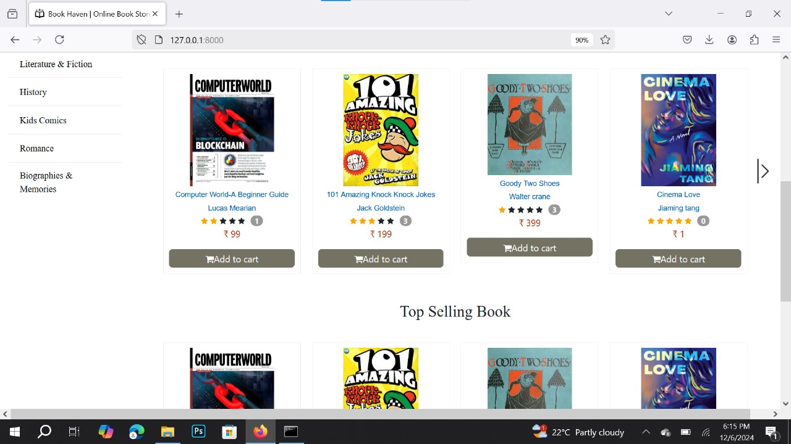
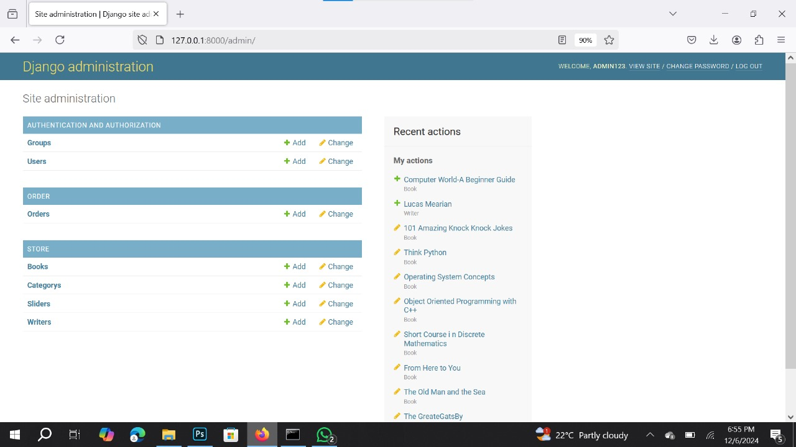

# Installation 


```
    pip install django-cors-headers
    pip install django-crispy-forms
    pip install xhtml2pdf
```

</br>





=======
# Online-Book-Store-Project
This project creates a fully-functional online bookstore using Python and Django. Customers can browse, search, and purchase books, with features like filtering, shopping cart, secure checkout (PayPal/Stripe), order tracking, and reviews. The admin panel supports inventory management, order processing, and sales monitoring.

